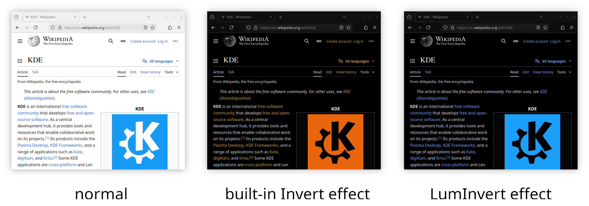

# kwin-effect-luminvert

KWin Desktop Effect to invert the luminance of window contents while preserving colors.

This is similar to the official `Invert` effect, but it preserves the colors by inverting the luminance in the YCbCr color space.



## Installation

On Arch Linux, you can install the package [`kwin-effect-luminvert-git` from the AUR](https://aur.archlinux.org/packages/kwin-effect-luminvert-git).

Otherwise install manually:

```sh
cmake -B build -S . -Wno-dev
cmake --build build
sudo cmake --install build
```

## Compatibility

This has been tested on Plasma 6 with KWin 6.1.5 (it could probably be backported to Plasma 5).
It is compatible with other effects such as wobbly windows.
It still works when HDR is enabled, however the colors get distorted sometimes.

## License

This repo is licensed under GPL-3.0-only.

This repo uses code from the invert plugin from https://github.com/KDE/kwin (imported from commit a00cad1).
Also, this repo uses CMake files from https://github.com/matinlotfali/KDE-Rounded-Corners (imported from commit 8b1ac40).
